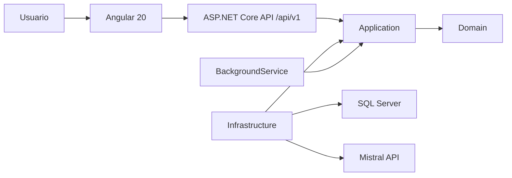

# Documento arquitectónico

## Objetivo

Separar reglas de negocio, casos de uso, adaptadores externos y transporte HTTP para permitir
pruebas aisladas y cambios de infraestructura con impacto controlado.

## Capas

- `KnowledgeAssistant.Domain`: entidades, objetos de valor e invariantes.
- `KnowledgeAssistant.Application`: casos de uso, DTO y puertos.
- `KnowledgeAssistant.Infrastructure`: EF Core, SQL Server, Mistral y procesos en segundo plano.
- `KnowledgeAssistant.Api`: controladores, middleware, DI y contrato HTTP.
- `frontend`: interfaz Angular, estado de presentación y clientes HTTP.

## Flujo principal

1. Angular valida el formulario y envía una solicitud REST.
2. La API valida el contrato y ejecuta un caso de uso.
3. Application coordina reglas de Domain mediante interfaces.
4. Infrastructure persiste en SQL Server o invoca Mistral.
5. La API devuelve DTO y errores consistentes con `ProblemDetails`.

## Escalabilidad

La primera versión es un monolito modular. Los límites de Application permiten extraer
procesamiento de IA o automatizaciones a procesos independientes si el volumen lo exige.
