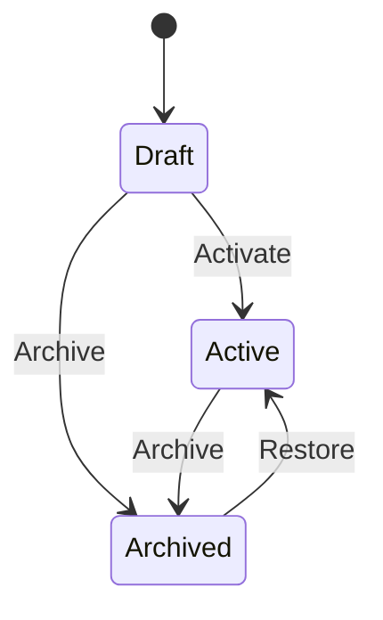
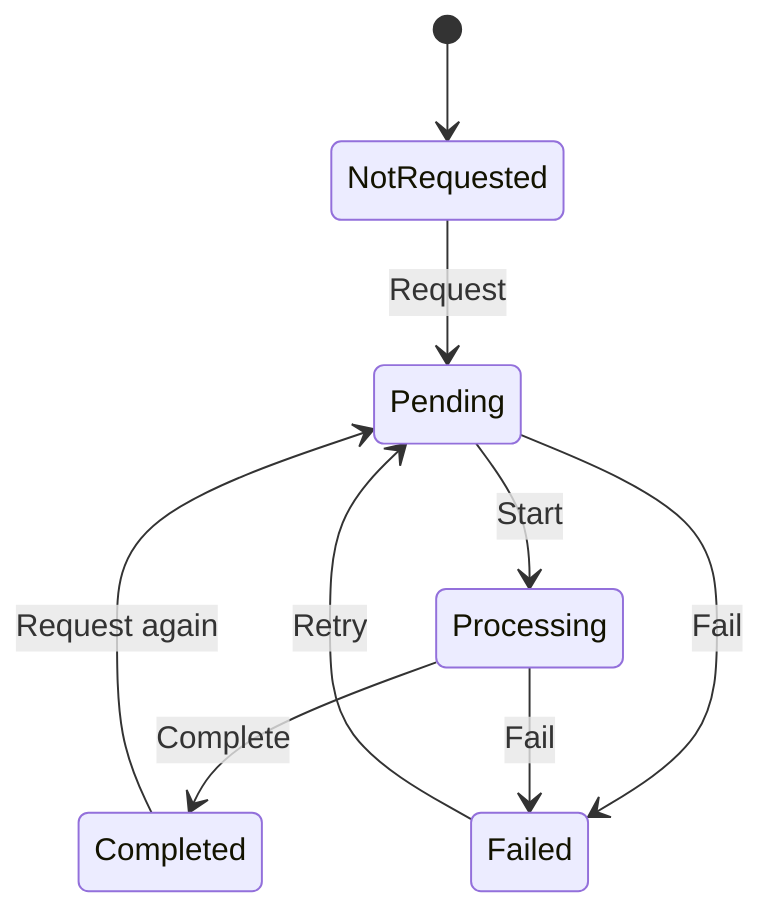

# Modelo de dominio

## KnowledgeRecord

`KnowledgeRecord` es el agregado principal para la información empresarial.

### Campos

- `Title`: obligatorio, máximo 200 caracteres.
- `Content`: obligatorio, máximo 50,000 caracteres.
- `Source`: opcional, máximo 500 caracteres.
- `Type`: `Document`, `Note` o `BusinessRecord`.
- `Status`: `Draft`, `Active` o `Archived`.
- `AiStatus`: estado del procesamiento de IA.
- `Summary`, `Category` y `Recommendations`: último enriquecimiento válido.
- Fechas de creación, actualización, archivo y procesamiento de IA en UTC.

### Ciclo de vida

Un registro archivado es inmutable y no puede enviarse a análisis. Debe restaurarse antes.
Tampoco puede archivarse mientras exista un análisis pendiente o en proceso.

### Procesamiento de IA

Al modificar el contenido o solicitar un nuevo análisis se eliminan los resultados anteriores
porque dejan de representar el estado actual. Cambiar únicamente título, fuente o tipo conserva
el análisis existente.

### Invariantes

- Los enums deben contener valores definidos.
- Los textos se normalizan eliminando espacios exteriores.
- Ningún campo puede exceder su límite.
- Las operaciones validan todos sus argumentos antes de modificar el agregado.
- Un análisis completado debe aportar al menos un resultado.
- Solo un análisis pendiente puede comenzar.
- Solo un análisis pendiente o en proceso puede fallar.
