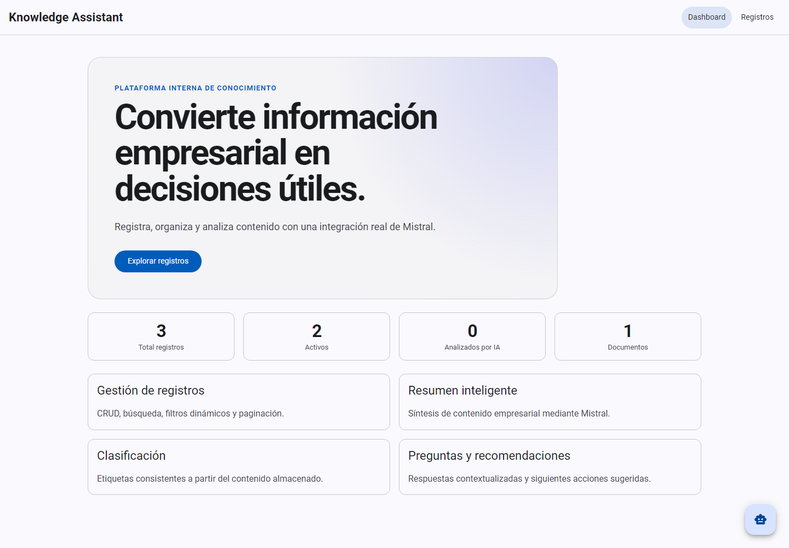
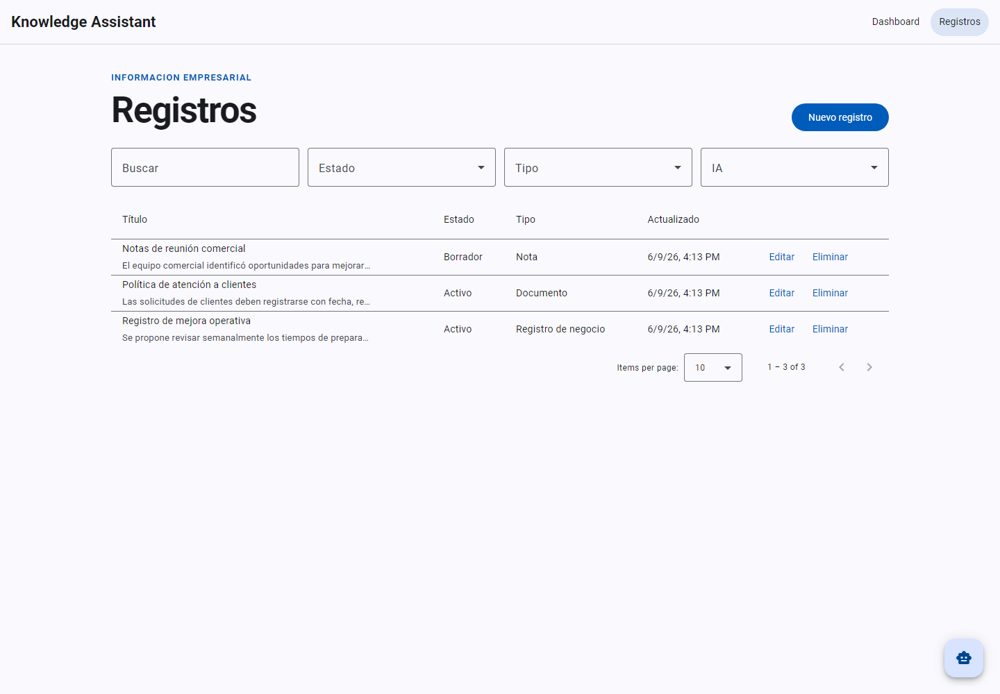
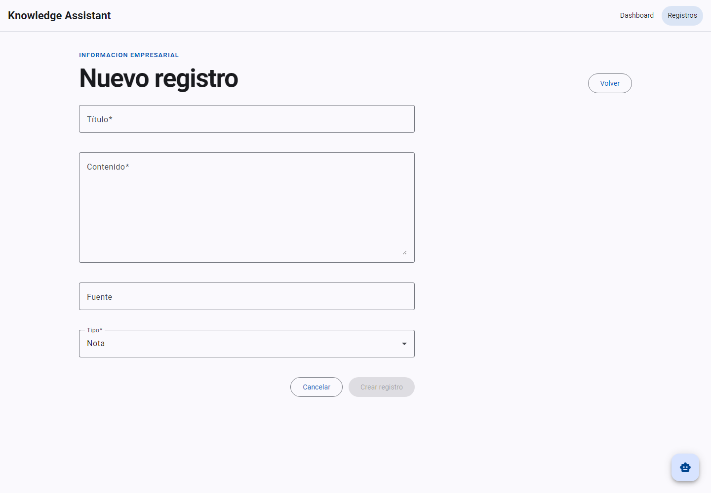
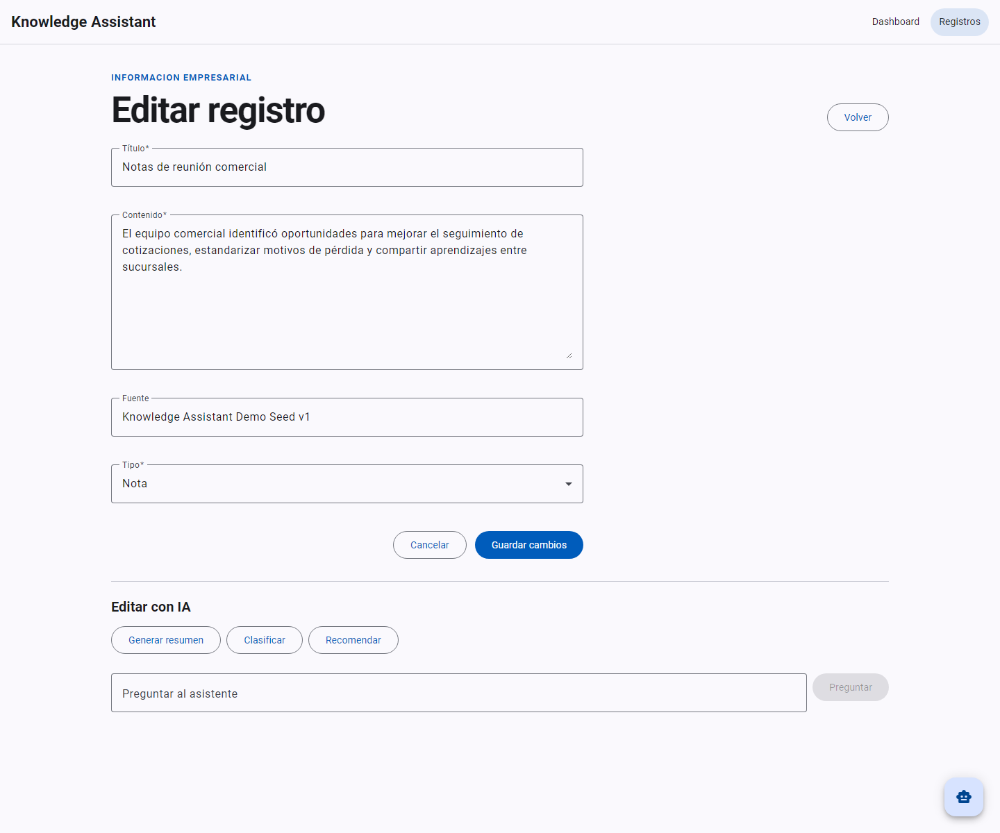

# Evidencias de entrega

Evidencias capturadas el 9 de junio de 2026 con el stack local de Docker Compose:

- frontend: `http://localhost:4200`;
- API: `http://localhost:8080`;
- SQL Server 2022 con estado saludable;
- datos semilla habilitados.

Las capturas no contienen secretos y no se realizaron solicitudes reales a Mistral.

## Evidencias funcionales

### Dashboard

Muestra navegación, indicadores calculados desde la API y accesos a los flujos principales.

### Listado de registros

Muestra datos semilla, búsqueda, filtros, paginación y acciones CRUD.

### Alta de registro

Muestra el formulario reactivo y el estado deshabilitado de creación mientras faltan campos
obligatorios.

### Edición y análisis IA

Muestra la edición de un registro persistido y las acciones de resumen, clasificación,
recomendaciones y preguntas. No se activó ninguna acción para evitar depender de una credencial
externa durante la captura.

## Evidencias de pruebas

| Validación | Resultado |
| --- | --- |
| `GET /api/v1/system/health` | HTTP 200, estado `Healthy` |
| `dotnet test KnowledgeAssistant.sln --configuration Release --collect:"XPlat Code Coverage"` | 91 unitarias y 48 de integración superadas, 0 omitidas |
| `node scripts/resolve-browser.mjs --watch=false --browsers=ChromeHeadless --code-coverage` | 38 pruebas superadas |
| `tsc -p tsconfig.app.json --noEmit` | Sin errores |
| `tsc -p tsconfig.spec.json --noEmit` | Sin errores |

Cobertura frontend registrada:

- statements: 86.2% (150/174);
- branches: 59.25% (32/54);
- functions: 80.35% (45/56);
- lines: 88.07% (133/151).

Las pruebas backend se ejecutaron contra una base `KnowledgeAssistantValidation` separada. Los
reportes de cobertura generados en `artifacts/` son salidas locales ignoradas por Git.
